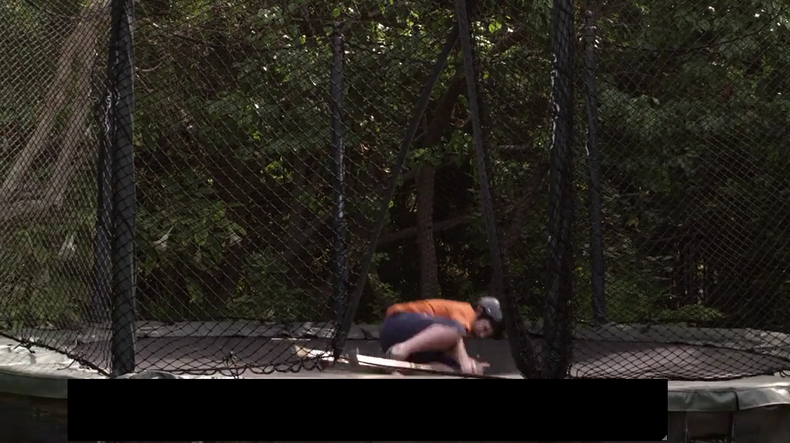
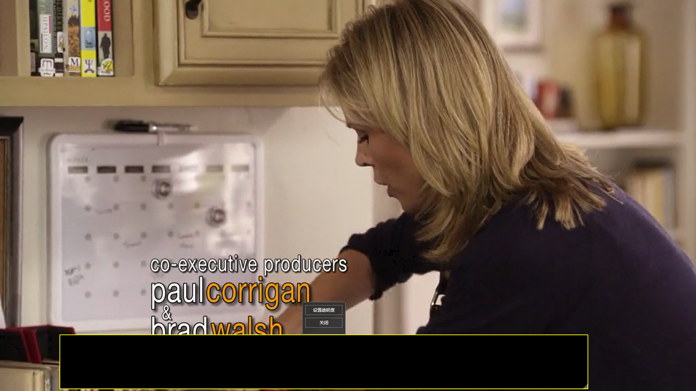

# SubtitleHider

一个轻量级的 Windows 桌面应用，用于在观看视频时遮挡字幕区域。


## 功能特性

- **透明遮挡窗口** - 创建一个可调整大小和位置的黑色覆盖层，遮挡视频字幕
- **透明度调节** - 支持自定义遮挡窗口的透明度（0-1）
- **始终置顶** - 即使视频播放器全屏，遮挡窗口也能保持在最上层
- **记住设置** - 自动记住窗口位置、大小和透明度，下次启动自动恢复
- **简洁交互** - 无标题栏设计，鼠标右键呼出设置菜单

## 截图

| 遮挡效果 | 右键菜单与设置 |
|:--------:|:-------------:|
|  |  |

## 下载

| 版本 | 大小 | 说明 |
|------|------|------|
| [SubtitleHider.exe](#) | ~172 KB | 框架依赖版本（需要 [.NET 8 桌面运行时](https://dotnet.microsoft.com/download/dotnet/8.0/runtime)） |
| [SubtitleHider-Full.exe](#) | ~155 MB | 自包含版本（无需安装任何运行时） |

> 如果电脑已安装 .NET 8，推荐使用框架依赖版本，体积更小。

## 使用方式

| 操作 | 说明 |
|------|------|
| 左键拖拽窗口中心 | 移动遮挡窗口位置 |
| 左键拖拽窗口边缘 | 调整遮挡窗口大小 |
| 鼠标悬停窗口 | 显示黄色边框提示边界 |
| 右键点击窗口 | 弹出菜单：设置透明度 / 关闭 |

## 项目结构

```
SubtitleHider/
├── SubtitleHider/
│   ├── App.xaml(.cs)          # 应用启动入口
│   ├── Hider.xaml(.cs)        # 遮挡窗口（主窗口）
│   ├── MainWindow.xaml(.cs)   # 透明度设置窗口
│   ├── WindowSettings.cs      # 配置文件读写
│   └── SubtitleHider.csproj   # 项目文件
├── SubtitleHider.sln          # 解决方案文件
├── README.md                  # 项目说明
├── CLAUDE.md                  # 开发者指南
└── .gitignore                 # Git 忽略配置
```

## 构建

需要 [.NET 8 SDK](https://dotnet.microsoft.com/download/dotnet/8.0)。

```bash
# 调试运行
cd SubtitleHider
dotnet build
dotnet run

# 发布框架依赖版本（172 KB，需安装 .NET 8）
dotnet publish -c Release -r win-x64 --self-contained false -p:PublishSingleFile=true -o ./publish

# 发布自包含版本（155 MB，无需 .NET 8）
dotnet publish -c Release -r win-x64 --self-contained true -p:PublishSingleFile=true -o ./publish-full
```

## 技术栈

- WPF (.NET 8)
- Win32 API（窗口始终置顶、边缘调整大小）
- JSON 配置文件持久化

## 配置文件

设置保存在 `%LocalAppData%/SubtitleHider/settings.json`：

```json
{
  "Left": 100,
  "Top": 800,
  "Width": 1125,
  "Height": 75,
  "Opacity": 1
}
```

## 许可证

[MIT](LICENSE)
